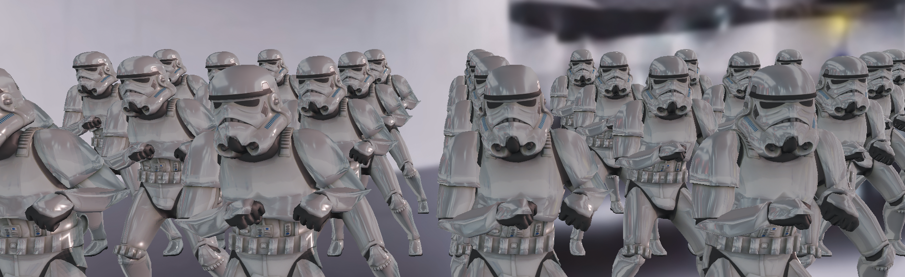

# CSEngine 에디터 개발 여정: 게임 엔진에 날개를 달다

> CSEngine의 Git 히스토리를 분석하여 에디터 개발 과정을 시간순으로 정리한 개발 기록입니다.



## 들어가며

게임 엔진을 만드는 것도 어려운 일이지만, 그 엔진을 위한 전용 에디터를 개발하는 것은 또 다른 도전입니다. CSEngine의 에디터 개발 여정을 Git 커밋 히스토리를 통해 살펴보며, 어떻게 단순한 3D 엔진이 완전한 개발 환경으로 진화했는지 알아보겠습니다.

## 🚀 프로젝트의 시작 (2020년 1월)

### 첫 번째 시도: "The Editor is being implemented"

**커밋: 868fce7 (2020-01-13)**

에디터 개발의 첫 시작은 야심찬 커밋 메시지와 함께였습니다. 이 시점에서 다음과 같은 기반 작업들이 이루어졌습니다:

- **스크립트 직렬화 시스템** 구현 시작
- **WindowBase** 클래스로 에디터 윈도우 아키텍처 설계
- **MainDocker** 클래스로 도킹 시스템 기반 마련
- **CustomComponent** 확장으로 게임 오브젝트 시스템 강화

```cpp
// WindowBase.h - 모든 에디터 윈도우의 기반 클래스
namespace CSEditor {
    class WindowBase {
    public:
        virtual ~WindowBase() = default;
        virtual void SetUI() = 0;  // 각 윈도우의 UI 렌더링
    protected:
        ImGuiViewport* m_mainViewport;
    };
}
```

이 단계에서 주목할 점은 단순히 UI만 만든 것이 아니라, **엔진 자체의 확장성**을 고려한 설계를 했다는 것입니다.

## 🏗️ 본격적인 프로젝트 구조화 (2022년 10월)

### Windows용 에디터 프로젝트 생성

**커밋: bc6bffa (2022-10-20)**

2년의 공백을 깨고, 본격적인 에디터 개발이 시작되었습니다:

```
Editor/platforms/Windows/
├── CMakeLists.txt          # CMake 빌드 시스템
├── CSEditor.sln            # Visual Studio 솔루션
├── CSEditor/               
│   ├── main.cpp           # 에디터 진입점
│   ├── imgui.ini          # ImGui 설정
│   └── 리소스 파일들...
└── CMake/                  # 빌드 유틸리티
```

**주요 특징:**
- **CMake 기반 빌드 시스템** 구축 (총 266줄의 Utils.cmake)
- **Visual Studio 통합** (.sln, .vcxproj 파일들)
- **멀티 플랫폼 아키텍처** 준비 (`platforms/Windows/` 구조)

```cpp
// main.cpp - 에디터의 진입점
int APIENTRY wWinMain(_In_ HINSTANCE hInstance, _In_opt_ HINSTANCE hPrevInstance,
                     _In_ LPWSTR lpCmdLine, _In_ int nCmdShow) {
    
    // GLFW 초기화 및 윈도우 생성
    glfwSetErrorCallback(glfw_error_callback);
    if (!glfwInit()) return 1;
    
    GLFWwindow* window = glfwCreateWindow(1280, 720, "CSEngine Editor", NULL, NULL);
    glfwMakeContextCurrent(window);
    
    // ImGui 초기화
    IMGUI_CHECKVERSION();
    ImGui::CreateContext();
    ImGuiIO& io = ImGui::GetIO(); (void)io;
    io.ConfigFlags |= ImGuiConfigFlags_DockingEnable; // 도킹 지원
    
    // 메인 도커 생성 및 렌더링 루프
    CSEditor::MainDocker docker;
    while (!glfwWindowShouldClose(window)) {
        glfwPollEvents();
        ImGui_ImplOpenGL3_NewFrame();
        ImGui_ImplGlfw_NewFrame();
        ImGui::NewFrame();
        
        docker.SetUI();  // 에디터 UI 렌더링
        
        ImGui::Render();
        ImGui_ImplOpenGL3_RenderDrawData(ImGui::GetDrawData());
        glfwSwapBuffers(window);
    }
    
    return 0;
}
```

이 커밋에서 무려 **1,891줄**의 코드가 추가되어, 에디터 개발의 진지함을 보여줍니다.

## 🎨 사용자 인터페이스의 탄생 (2023년 8월)

### 핵심 시스템들의 구현

**커밋: 3770cce (2023-08-23) - 프리뷰 엔진 코어 추가**

에디터의 핵심 기능 중 하나인 **실시간 프리뷰 시스템**이 구현되었습니다:

- **EPreviewCore**: 별도의 렌더링 컨텍스트를 가진 프리뷰 엔진
- **EEngineCore**: 에디터 전용 엔진 코어로 기존 EngineCoreInstance 확장
- **프레임버퍼 분리**: 메인 엔진과 독립적인 렌더링 파이프라인

```cpp
// EEngineCore.cpp - 싱글톤 패턴과 프리뷰 모드 분기
class EEngineCore : public CSE::EngineCoreInstance {
public:
    static EngineCoreInstance* getInstance() {
        if (sInstance == nullptr) sInstance = new EEngineCore;
        if (sInstance->IsPreview())
            return sInstance->m_previewCore;  // 프리뷰 모드일 때
        return sInstance;                     // 에디터 모드일 때
    }
    
    void StartPreviewCore() {
        if (m_previewCore == nullptr) {
            m_previewCore = new EPreviewCore();
            m_previewCore->Init(m_previewWidth, m_previewHeight);
        }
    }
    
    void StopPreviewCore() {
        if (m_previewCore != nullptr) {
            m_previewCore->Exterminate();
            delete m_previewCore;
            m_previewCore = nullptr;
        }
    }
};
```

### 윈도우 시스템 완성

**커밋: cbd01fd (2023-08-27) - 계층구조와 콘솔 윈도우 구현**

에디터다운 에디터가 되기 위한 필수 요소들이 추가되었습니다:

```cpp
// 새로 추가된 윈도우들
├── HierarchyWindow     // 씬 오브젝트 트리 뷰
├── ConsoleWindow       // 로그 및 디버그 정보
└── ELogMgr            // 에디터 전용 로깅 시스템
```

**기술적 하이라이트:**
- **HierarchyData** 구조체로 오브젝트 관계 관리
- **ELogMgr**로 엔진 로그와 에디터 로그 분리
- **ImGui 기반 도킹 시스템**으로 유연한 레이아웃

```cpp
// HierarchyWindow.cpp - 씬 오브젝트 트리 렌더링
void HierarchyWindow::SetUI() {
    ImGui::Begin("Hierarchy");
    
    RenderTrees();  // 씬의 오브젝트 계층구조 렌더링
    
    // 키 입력 감지로 에디터 렌더링 트리거
    if (!m_core->IsPreview() && (ImGui::IsWindowFocused() || ImGui::IsWindowHovered())) {
        for (ImGuiKey key = static_cast<ImGuiKey>(0); key < ImGuiKey_COUNT; key = (ImGuiKey)(key + 1)) {
            if (ImGui::IsKeyDown(key)) {
                m_core->InvokeEditorRender();  // 실시간 업데이트
                break;
            }
        }
    }
    
    ImGui::End();
}

void HierarchyWindow::RenderTrees() {
    const auto& sceneMgr = CORE->GetSceneMgrCore();
    const auto& scene = dynamic_cast<CSE::SScene*>(sceneMgr->GetCurrentScene());
    if (scene == nullptr) return;
    
    const auto& root = scene->GetRoot();
    // 재귀적으로 오브젝트 트리 렌더링...
}
```

## 📁 에셋 관리 시스템 (2023년 9월)

### 에셋 익스플로러의 등장

**커밋: a13ea74 (2023-09-11)**

진정한 게임 에디터의 필수 요소인 **에셋 브라우저**가 구현되었습니다:

```cpp
class AssetWindow {
private:
    std::unordered_map<std::string, AssetsVector> m_assets;
    std::string m_currentPath;
    std::queue<void*> m_previewAssetQueue;
    std::vector<std::string> m_pathSelector;
    
public:
    void RefreshAssets();
    void OnDragDrop(const AssetReference& asset);
    bool OnAssetClickEvent(const AssetReference& asset);
};
```

**핵심 기능들:**
- **폴더 트리 네비게이션**
- **에셋 프리뷰 시스템**
- **드래그 앤 드롭** 인터페이스
- **동적 에셋 갱신**

```cpp
// AssetWindow.cpp - 에셋 브라우저 UI 구현
void AssetWindow::SetUI() {
    ImGui::Begin("Assets Explorer");
    
    if (m_assets.empty()) {
        RefreshAssets();
        RefreshExplorer();
        m_targetPath = CSE::AssetsPath();
    }
    
    // 경로 네비게이션 버튼들 렌더링
    ImGui::BeginGroup();
    std::string targetPath = m_targetPath;
    if (ImGui::Button("Assets")) {
        ChangeCurrentPath(targetPath);
        RefreshExplorer();
        return;
    }
    
    ImGui::SameLine();
    ImGui::Text(">");
    ImGui::SameLine();
    
    // 경로의 각 세그먼트를 버튼으로 렌더링
    for (const auto& pathNode: m_pathSelector) {
        if (pathNode.empty()) continue;
        targetPath += pathNode + '/';
        if (ImGui::Button(pathNode.c_str())) {
            ChangeCurrentPath(targetPath);
            RefreshExplorer();
            break;
        }
        ImGui::SameLine();
        ImGui::Text(">");
        ImGui::SameLine();
    }
    ImGui::EndGroup();
    
    // 에셋 아이템들 렌더링...
    ImGui::End();
}
```

### 드래그 앤 드롭 시스템

**커밋: a39505a (2023-09-13)**

사용자 경험을 크게 향상시키는 **직관적인 에셋 관리** 기능이 추가되었습니다.

## 🎭 머티리얼 에디터 (2023년 10월)

### 고급 머티리얼 편집 기능

**커밋: 71ee7b2 (2023-10-12)**

PBR 렌더링을 지원하는 CSEngine에 걸맞는 **머티리얼 에디터**가 구현되었습니다:

```cpp
class MaterialLayer {
private:
    // 머티리얼 파라미터들을 레이어 형태로 관리
public:
    void RenderMaterialUI();
    void UpdateMaterialProperties();
};
```

**기술적 특징:**
- **레이어 기반 머티리얼 시스템**
- **실시간 프리뷰** 업데이트
- **인스펙터 통합** UI

```cpp
// MaterialLayer.cpp - 머티리얼 속성 에디터
void MaterialLayer::RenderUI() {
    // 머티리얼 참조가 변경되었는지 확인
    if(m_render->GetMaterialReference() != m_material_ref) {
        m_material = m_render->GetMaterial();
        m_material_ref = m_render->GetMaterialReference();
        MaterialLayer::InitParams();  // 파라미터 재초기화
    }
    
    if (!ImGui::CollapsingHeader(m_name.c_str(), ImGuiTreeNodeFlags_DefaultOpen))
        return;
    
    // 드래그 앤 드롭 소스로 설정
    if (ImGui::BeginDragDropSource(ImGuiDragDropFlags_None)) {
        ImGui::SetDragDropPayload("INSP_RES", m_material, sizeof(CSE::SResource));
        ImGui::EndDragDropSource();
    }
    
    // 머티리얼 파라미터들을 테이블 형태로 렌더링
    ImGui::BeginTable(m_material->GetHash().c_str(), 2, ImGuiTableFlags_None);
    
    for (const auto& param: m_params) {
        const auto& name = param->GetName();
        ImGui::TableNextRow();
        ImGui::TableSetColumnIndex(0);
        ImGui::Text("%s", name.c_str());
        ImGui::TableSetColumnIndex(1);
        param->RenderUI();  // 각 파라미터 타입에 맞는 UI 렌더링
    }
    
    ImGui::EndTable();
}
```

## 🖼️ 에셋 프리뷰 시스템 (2023년 10월-11월)

### 프리뷰 매니저의 도입

**커밋: 2784054 (2023-10-29)**

에디터의 생산성을 크게 향상시키는 **에셋 프리뷰 시스템**이 구현되었습니다:

```cpp
// EAssetPreviewMgr.cpp - 에셋 프리뷰 생성 및 관리
class EAssetPreviewMgr {
private:
    std::unordered_map<std::string, CSE::SResource*> m_previews;
    CSE::ResMgr* m_editorResMgr;

public:
    CSE::STexture* GetPreview(std::string& hash) {
        const auto& iter = m_previews.find(hash);
        SResource* res = nullptr;
        
        if (iter != m_previews.end()) 
            res = iter->second;  // 캐시된 프리뷰 사용
        else 
            res = GeneratePreview(hash);  // 새 프리뷰 생성
        
        if(res->IsSameClass(STexture::GetClassStaticType())) {
            return static_cast<STexture*>(res);
        }
        return nullptr;
    }
    
    SResource* GeneratePreview(std::string& hash) {
        const auto& asset = m_editorResMgr->GetAssetReference(hash);
        const auto& res = SResource::Create(asset, asset->class_type);
        
        if (res->IsSameClass(STexture::GetClassStaticType())) {
            // 프리뷰 캐시에 저장
            m_previews.insert(std::pair<std::string, CSE::SResource*>(res->GetHash(), res));
            return res;
        }
    }
};
```

### 실시간 프리뷰 업데이트

**커밋: de2d007 (2023-10-31), d26a689 (2023-10-31)**

- **편집 모드에서의 실시간 렌더링**
- **트랜스폼 변경 감지** 및 자동 업데이트
- **최적화된 렌더링 사이클**

## 🎯 모델 가져오기 기능 (2024년 5월)

### 완성도 높은 에셋 파이프라인

**커밋: c4fce31 (2024-05-09)**

마침내 **모델을 에디터 씬으로 직접 가져오는** 기능이 구현되었습니다:

```cpp
// HierarchyWindow에서 직접 모델 임포트 지원
void ImportModelToScene(const std::string& modelPath);
void CreateGameObjectFromPrefab(SPrefab* prefab);
```

**주요 개선사항:**
- **스키닝 오브젝트 버그 수정**
- **SPrefab 시스템 강화**
- **계층구조 윈도우 통합**

## 🏛️ 아키텍처 분석: 왜 이렇게 설계했을까?

### 1. 분리된 에디터 코어 시스템

```cpp
class EEngineCore : public CSE::EngineCoreInstance {
    // 기본 엔진 코어를 상속받아 에디터 전용 기능 확장
    EPreviewCore* m_previewCore;  // 독립적인 프리뷰 렌더링
    ELogMgr* m_logMgr;           // 에디터 전용 로깅
    HierarchyData* m_hierarchyData; // UI 상태 관리
};
```

**설계 철학:**
- 기존 엔진 코드를 건드리지 않고 **확장성** 확보
- **프리뷰와 실제 게임의 분리**로 안정성 향상
- **모듈화된 구조**로 유지보수성 증대

### 2. ImGui 기반 도킹 시스템

```cpp
// MainDocker.cpp - 도킹 시스템과 윈도우 관리
class MainDocker : public WindowBase {
private:
    std::vector<WindowBase*> m_windows;
    ImGuiWindowFlags m_windowFlags = ImGuiWindowFlags_MenuBar | ImGuiWindowFlags_NoDocking;

public:
    void SetUI() override {
        if (!m_bIsInit) GenerateWindows();
        
        // 메인 뷰포트에 맞춰 윈도우 설정
        ImGui::SetNextWindowPos(m_mainViewport->WorkPos);
        ImGui::SetNextWindowSize(m_mainViewport->WorkSize);
        ImGui::SetNextWindowViewport(m_mainViewport->ID);
        
        // 윈도우 스타일 설정
        ImGui::PushStyleVar(ImGuiStyleVar_WindowRounding, 0.0f);
        ImGui::PushStyleVar(ImGuiStyleVar_WindowBorderSize, 0.0f);
        m_windowFlags |= ImGuiWindowFlags_NoTitleBar | ImGuiWindowFlags_NoCollapse;
        
        // 메인 도킹 스페이스 생성
        ImGui::Begin("DockSpace", nullptr, m_windowFlags);
        ImGuiID dockspace_id = ImGui::GetID("MainDockSpace");
        ImGui::DockSpace(dockspace_id, ImVec2(0.0f, 0.0f), ImGuiDockNodeFlags_None);
        
        // 각 윈도우의 UI 렌더링
        SetWindowsUI();
        
        ImGui::End();
    }
    
private:
    void GenerateWindows() {
        m_windows.push_back(new PreviewWindow());
        m_windows.push_back(new HierarchyWindow());
        m_windows.push_back(new InspectorWindow());
        m_windows.push_back(new ConsoleWindow());
        m_windows.push_back(new AssetWindow());
        m_bIsInit = true;
    }
};
```

**장점:**
- **유연한 레이아웃** 구성 가능
- **크로스 플랫폼** 지원
- **빠른 프로토타이핑**

### 3. 컴포넌트 기반 윈도우 시스템

```cpp
WindowBase
├── AssetWindow      // 에셋 브라우저
├── HierarchyWindow  // 계층구조 뷰
├── InspectorWindow  // 속성 에디터
├── ConsoleWindow    // 로그 뷰어
└── PreviewWindow    // 게임 프리뷰
```

## 📊 개발 통계 및 인사이트

### 개발 기간 분석
- **2020년 1월**: 첫 시도 (기반 작업)
- **2022년 10월**: 본격적인 시작 (프로젝트 구조화)
- **2023년 8-11월**: 핵심 기능 집중 개발 (4개월간 폭발적 성장)
- **2024년 5월**: 완성도 높은 기능 추가 (모델 임포트)

### 코드 규모
- **Windows 프로젝트 생성**: +1,891 줄
- **UI 시스템 구축**: 평균 50-100줄의 지속적인 개발
- **총 에디터 전용 클래스**: 15개 이상

## 🔮 미래를 위한 설계

CSEngine 에디터의 아키텍처에서 주목할 점은 **확장성**을 염두에 둔 설계입니다:

1. **플랫폼 독립적 구조** (`platforms/` 디렉터리)
2. **모듈화된 윈도우 시스템** (새 윈도우 추가 용이)
3. **분리된 렌더링 컨텍스트** (프리뷰와 게임 독립)
4. **리플렉션 시스템 통합** (자동화된 UI 생성)

## 마무리: 개발자의 관점에서

CSEngine 에디터 개발 과정을 살펴보면서 인상 깊었던 점들:

1. **점진적 개발**: 한번에 모든 것을 구현하려 하지 않고, 핵심 기능부터 차근차근
2. **아키텍처 우선**: UI를 만들기 전에 견고한 기반 시스템 구축
3. **사용자 경험 고려**: 드래그 앤 드롭, 실시간 프리뷰 등 직관적인 인터페이스
4. **엔진과의 분리**: 기존 엔진 코드를 건드리지 않는 깔끔한 확장

이러한 개발 여정을 통해 CSEngine은 단순한 3D 렌더링 엔진에서 **완전한 게임 개발 환경**으로 진화했습니다. 

---

*이 문서는 CSEngine의 실제 Git 커밋 히스토리를 분석하여 작성되었습니다. 각 단계에서의 기술적 도전과 해결 과정을 통해 게임 엔진 에디터 개발의 복잡성과 흥미로움을 엿볼 수 있습니다.*